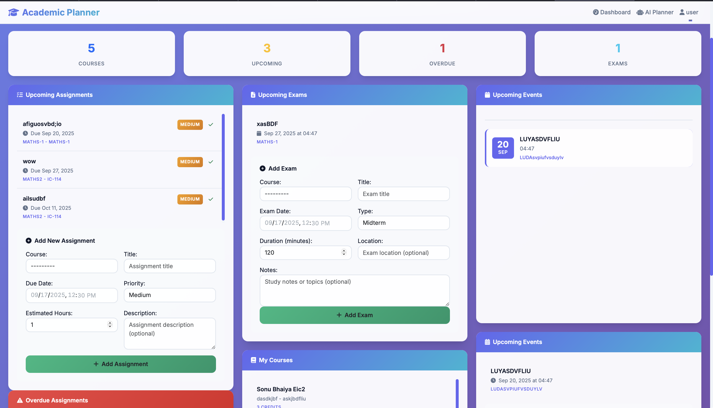
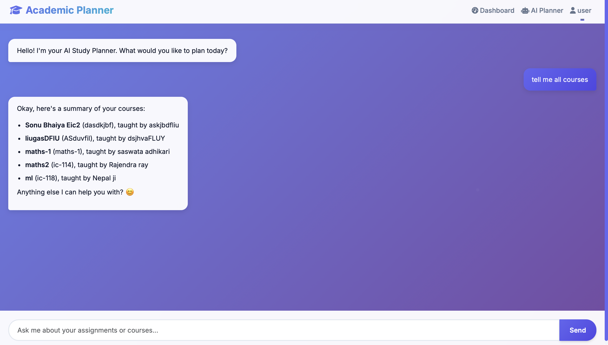
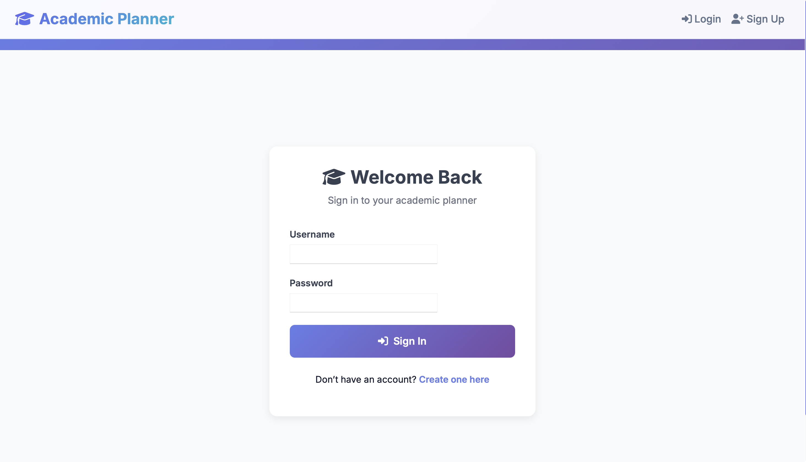
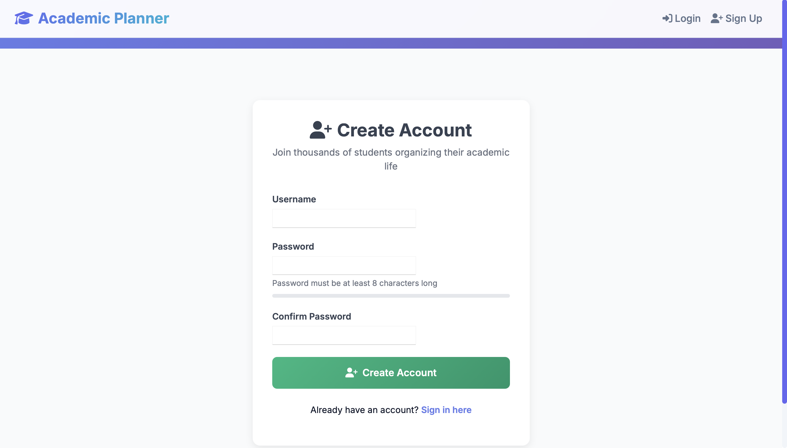

# 🎓 Academic Planner - Advanced Student Management System

A **professional-grade** academic planner web application built with Django, featuring a modern UI, AI-powered assistance, and comprehensive student management tools. This application helps students organize their academic life with style and efficiency.

   

---

## 🖼️ Screenshots

### Dashboard



### AI Chat Assistant



### Login Page



### Signup Page




---

## ✨ **What's New in This Version**

### 🎨 **Completely Redesigned UI**

* **Modern glassmorphism design** with gradient backgrounds
* **Smooth animations** and micro-interactions
* **Responsive design** that works perfectly on all devices
* **Professional color scheme** with CSS custom properties
* **Beautiful authentication pages** with floating animations

### 🤖 **AI-Powered Academic Assistant**

* **Intelligent chatbot** powered by Google Gemini AI
* **Natural language processing** for course and assignment management
* **Smart academic summaries** with beautiful formatting
* **Voice-like interactions** with emojis and rich responses
* **Automated data entry** through conversational interface

### 🚀 **Enhanced Features**

* **Priority-based assignment management** (Low, Medium, High, Urgent)
* **Advanced calendar integration** with color-coded events
* **Comprehensive attendance tracking** with percentage calculations
* **Real-time notifications** and status indicators
* **CRUD operations** for all academic entities

---

## 🌟 **Core Features**

### 🔐 **Advanced Authentication**

* **Secure user registration** with password strength indicators
* **Beautiful login/signup pages** with modern design
* **Session management** with automatic timeout
* **Password validation** with security requirements

### 📚 **Smart Course Management**

* **Detailed course information** (name, code, instructor, credits)
* **Color-coded courses** for visual organization
* **Course-specific dashboards** with attendance tracking
* **Instructor and credit hour tracking**

### 📝 **Intelligent Assignment System**

* **Priority levels** with visual indicators (🟢🟡🟠🔴)
* **Completion tracking** with one-click toggles
* **Due date management** with overdue detection
* **Description fields** for detailed instructions
* **Estimated time tracking** for better planning

### 📋 **Comprehensive Exam Management**

* **Multiple exam types** (Midterm, Final, Quiz, Project, Presentation)
* **Duration and location tracking**
* **Study notes** and topic management
* **Visual exam calendar** with type indicators

### 🎉 **Advanced Event System**

* **Multiple event types** (Personal, Academic, Social, Other)
* **Start and end time** management
* **Location tracking** for events
* **Color customization** for visual organization

### ✅ **Detailed Attendance Tracking**

* **Present/Absent** status with notes
* **Attendance percentage** calculations
* **Course-specific** attendance records
* **Date-based** tracking with historical data

### 📅 **Interactive Calendar**

* **FullCalendar.js integration** with multiple view modes
* **Color-coded events** by course and type
* **Drag-and-drop** functionality
* **Event details** on click
* **Real-time updates** from database

---

## 🛠️ **Technology Stack**

### **Backend**

* **Django 4.2** - Robust web framework
* **Python 3.9+** - Modern Python features
* **SQLite/PostgreSQL** - Flexible database options
* **Django REST Framework** - API capabilities
* **Google Gemini AI** - AI-powered assistance

### **Frontend**

* **Bootstrap 5.3** - Modern CSS framework
* **FullCalendar.js** - Interactive calendar
* **Marked.js** - Markdown parsing
* **Font Awesome 6** - Professional icons
* **Custom CSS** - Advanced styling and animations

### **AI Integration**

* **Google Gemini 1.5 Pro** - Advanced language model
* **Function calling** - Direct database operations
* **Natural language processing** - Conversational interface
* **Smart formatting** - Beautiful response rendering

---

## 🚀 **Getting Started**

### **Prerequisites**

```bash
Python 3.9+
Django 4.2+
pip (Python package manager)
```

### **Installation**

1. **Clone the repository**

```bash
git clone <repository-url>
cd academic_planner_project
```

2. **Create virtual environment**

```bash
python -m venv venv
source venv/bin/activate  # On Windows: venv\Scripts\activate
```

3. **Install dependencies**

```bash
pip install -r requirements.txt
```

4. **Set up environment variables**

```bash
# Create .env file in project root
DJANGO_SECRET_KEY=your-secret-key-here
GOOGLE_API_KEY=your-gemini-api-key-here
DEBUG=True
```

5. **Run migrations**

```bash
python manage.py makemigrations
python manage.py migrate
```

6. **Create superuser (optional)**

```bash
python manage.py createsuperuser
```

7. **Start development server**

```bash
python manage.py runserver
```

8. **Access the application**

```
Open http://127.0.0.1:8000 in your browser
```

---

## 📱 **Usage Guide**

### **Dashboard Overview**

* **Statistics cards** showing key metrics
* **Upcoming assignments** with priority indicators
* **Overdue items** with urgent styling
* **Recent activity** and notifications
* **Interactive calendar** with all events

### **Adding Academic Data**

1. **Courses**: Use the course form or ask AI "Add course Advanced Mathematics with code MATH301"
2. **Assignments**: Specify course, title, due date, and priority
3. **Exams**: Include exam type, duration, and location
4. **Events**: Add personal or academic events with descriptions
5. **Attendance**: Track daily class attendance

### **AI Assistant Commands**

* **"Show me all my courses"** - Get formatted course summary
* **"What assignments do I have?"** - View upcoming assignments
* **"Add assignment Final Project to CS101 due tomorrow with high priority"** - Smart assignment creation
* **"Add midterm exam for MATH301 on December 15th at 2 PM"** - Exam scheduling
* **"What's my academic summary?"** - Comprehensive overview

---

## 🏗️ **Project Structure**

```
academic_planner_project/
├── academic_planner_project/          # Main Django project
│   ├── settings.py                   # Enhanced settings with security
│   ├── urls.py                       # URL routing
│   └── wsgi.py                       # WSGI configuration
│
├── academic_app/                     # Core academic functionality
│   ├── models.py                     # Enhanced data models
│   ├── views.py                      # Advanced view logic
│   ├── forms.py                      # Smart form handling
│   ├── admin.py                      # Professional admin interface
│   └── migrations/                   # Database migrations
│
├── gemini_agent_app/                 # AI assistant functionality
│   ├── agent.py                      # AI agent configuration
│   ├── tools.py                      # AI tool functions
│   └── views.py                      # Chat interface views
│
├── templates/                        # Beautiful HTML templates
│   ├── base.html                     # Modern base template
│   ├── index.html                    # Enhanced dashboard
│   ├── chat_ui.html                  # AI chat interface
│   └── registration/                 # Auth templates
│       ├── login.html               # Beautiful login page
│       └── signup.html              # Stunning signup page
│
├── static/                           # Static files directory
├── logs/                            # Application logs
├── db.sqlite3                       # Database file
├── manage.py                        # Django management
└── README.md                        # This file
```

---

## 🎯 **Key Features in Detail**

### **🎨 Modern UI/UX**

* **Glassmorphism effects** with backdrop blur
* **Gradient backgrounds** and smooth transitions
* **Responsive grid layouts** for all screen sizes
* **Custom animations** and hover effects
* **Professional typography** with Inter font family

### **🤖 AI Assistant Capabilities**

* **Natural language understanding** for academic queries
* **Smart data extraction** from conversational input
* **Automatic form filling** and validation
* **Contextual responses** with academic terminology
* **Error handling** with helpful suggestions

### **📊 Advanced Data Management**

* **Relational data models** with proper constraints
* **Optimized database queries** with select\_related
* **Data validation** and error handling
* **Audit trails** with created/updated timestamps
* **Soft deletes** and data integrity

### **🔒 Security Features**

* **CSRF protection** on all forms
* **Session security** with timeout
* **Password validation** with strength requirements
* **SQL injection prevention** with Django ORM
* **XSS protection** with template escaping

---

## 🚀 **Deployment**

### **Production Settings**

```python
# Update settings.py for production
DEBUG = False
ALLOWED_HOSTS = ['your-domain.com']
SECURE_SSL_REDIRECT = True
SECURE_HSTS_SECONDS = 31536000
```

### **Environment Variables**

```bash
DJANGO_SECRET_KEY=your-production-secret-key
GOOGLE_API_KEY=your-gemini-api-key
DEBUG=False
ALLOWED_HOSTS=your-domain.com
```

### **Database Migration**

```bash
# For PostgreSQL
pip install psycopg2-binary
# Update DATABASES in settings.py
python manage.py migrate
```

---

## 🤝 **Contributing**

We welcome contributions! Please follow these steps:

1. **Fork the repository**
2. **Create a feature branch** (`git checkout -b feature/amazing-feature`)
3. **Commit your changes** (`git commit -m 'Add amazing feature'`)
4. **Push to the branch** (`git push origin feature/amazing-feature`)
5. **Open a Pull Request**

---

## 📄 **License**

This project is licensed under the MIT License - see the [LICENSE](LICENSE) file for details.

---

## 🙏 **Acknowledgments**

* **Django Community** for the excellent web framework
* **Google** for the Gemini AI capabilities
* **Bootstrap Team** for the responsive CSS framework
* **FullCalendar.js** for the interactive calendar component

---

## 📞 **Support**

If you encounter any issues or have questions:

1. **Check the documentation** above
2. **Search existing issues** in the repository
3. **Create a new issue** with detailed description
4. **Contact the development team**

---

**Made with ❤️ for students who want to excel academically!** 🎓✨
